# 智慧社区管理平台 - 类图

本文档展示了整个项目的类结构和关系图。

## 完整类图

```mermaid
classDiagram
    %% ========== 核心实体类 ==========

    class UserInfo {
        +string userId
        +string phone
        +string email
        +string avatar
        +string gender
        +number age
        +number userType
        +number status
        +string userName
    }

    class UserRole {
        +number roleId
        +string roleName
        +string roleCode
        +string description
        +number status
    }

    class UserPermission {
        +number permissionId
        +string permissionName
        +string permissionCode
        +string description
        +number status
    }

    %% ========== Pinia Store 类 ==========

    class UserStore {
        +Ref~string~ token
        +Ref~UserInfo~ userInfo
        +Ref~UserRole~ userRole
        +Ref~UserRole[]~ userRoles
        +Ref~UserPermission[]~ userPermissions
        +Computed~boolean~ isLoggedIn
        +Computed~string~ displayName
        +setLoginState(token, user)
        +setRole(role)
        +setRoles(roles)
        +setPermissions(permissions)
        +logout()
    }

    class AgentStore {
        +string|number|null sessionId
        +string sessionTitle
        +setSession(id, title)
        +updateTitle(title)
        +clearSession()
    }

    %% ========== WebSocket 相关类 ==========

    class WebSocketMessage {
        +string type
        +number messageId
        +number fromUserId
        +string fromUserName
        +string fromUserAvatar
        +number toUserId
        +string content
        +string createTime
        +number isRead
    }

    class WebSocketManager {
        +Ref~WebSocket~ ws
        +Ref~boolean~ isConnected
        +Ref~boolean~ isConnecting
        +Ref~number~ reconnectAttempts
        +connect()
        +disconnect()
        +send(message)
        +sendHeartbeat()
        +sendReadReceipt(messageId, toUserId)
        +onMessage(callback)
        -startHeartbeat()
        -stopHeartbeat()
        -attemptReconnect()
    }

    %% ========== 聊天相关类 ==========

    class ChatMessage {
        +number messageId
        +number fromUserId
        +string fromUserName
        +string fromUserAvatar
        +number toUserId
        +string toUserName
        +string toUserAvatar
        +string content
        +number isRead
        +string createTime
        +string readTime
    }

    class ChatSession {
        +number userId
        +string userName
        +string avatar
        +string lastMessage
        +string lastMessageTime
        +number unreadCount
        +boolean isOnline
    }

    class ChatManager {
        +Ref~boolean~ loading
        +Ref~boolean~ sending
        +Ref~ChatUser~ currentChatUser
        +Ref~ChatMessage[]~ messages
        +Ref~number~ total
        +Ref~number~ unreadCount
        +getChatHistory(userId, params)
        +sendMessage(toUserId, content)
        +markMessageRead(messageId, toUserId)
        +markAllMessagesRead(otherUserId)
        +getUnreadCount()
        +checkUserOnline(userId)
        +openChat(user)
        +closeChat()
        -handleWebSocketMessage(message)
    }

    %% ========== 商城相关类 ==========

    class MallProduct {
        +number productId
        +string productName
        +string description
        +number price
        +number originalPrice
        +string coverImg
        +string[] detailImgs
        +number stock
        +number sales
        +number categoryId
        +boolean isCollected
        +string status
    }

    class MallCategory {
        +number categoryId
        +string categoryName
        +string description
        +number sortOrder
        +number status
    }

    class CartItem {
        +number cartId
        +number productId
        +string productName
        +string productImage
        +number quantity
        +number price
        +number subtotal
    }

    class MallGoodsManager {
        +State~MallProduct[]~ goodsList
        +State~MallProduct[]~ subsidyList
        +State~CartItem[]~ cartList
        +State~MallCategory[]~ categoryList
        +State~string~ searchKeyword
        +State~number~ searchCategoryId
        +State~boolean~ loading
        +fetchCategories()
        +fetchGoodsList(page, isLoadMore, size)
        +loadMore()
        +handleSearch(keyword, categoryId)
        +fetchDetail(productId)
        +fetchCollect(productId)
        +fetchCancelCollect(productId)
        +fetchProductImages(productId)
        +fetchAddToCart(data)
        +fetchCartList()
        +fetchRemoveCart(cartItemId)
        +fetchUpdateCartQuantity(cartItem, quantity)
    }

    %% ========== 论坛相关类 ==========

    class ForumSection {
        +number sectionId
        +string sectionName
        +string sectionDesc
        +string iconUrl
        +number sortOrder
        +number postCount
        +number status
        +string createTime
    }

    class ForumPost {
        +number postId
        +number sectionId
        +string sectionName
        +number userId
        +string userName
        +string userAvatar
        +string title
        +string content
        +string contentSummary
        +string images
        +string firstImage
        +number viewCount
        +number likeCount
        +number commentCount
        +number collectCount
        +number isTop
        +number isEssence
        +boolean isLiked
        +boolean isCollected
        +string createTime
        +string updateTime
    }

    %% ========== 订单相关类 ==========

    class Order {
        +number orderId
        +string orderNo
        +number userId
        +string orderType
        +string orderTypeDesc
        +number amount
        +string paymentMethod
        +string paymentMethodDesc
        +number status
        +string statusDesc
        +number storeId
        +string storeName
        +string description
        +number relatedId
        +string createTime
        +string callbackTime
        +string pickUpTime
        +string finishTime
        +string expireTime
        +OrderProduct[] products
    }

    class OrderProduct {
        +number productId
        +string productName
        +string productImage
        +number quantity
        +number price
        +number subtotal
    }

    %% ========== 好友相关类 ==========

    class Friend {
        +number friendId
        +number friendUserId
        +string friendUserName
        +string friendAvatar
        +string remark
        +number status
        +string createTime
    }

    class FriendRequest {
        +number friendId
        +number fromUserId
        +string fromUserName
        +string fromUserAvatar
        +number toUserId
        +string remark
        +number status
        +string createTime
    }

    %% ========== 通知相关类 ==========

    class Notification {
        +number notificationId
        +number userId
        +number type
        +string title
        +string content
        +number relatedId
        +number isRead
        +string createTime
    }

    %% ========== 访客相关类 ==========

    class Visitor {
        +number registerId
        +number userId
        +string visitorName
        +string visitorPhone
        +string visitPurpose
        +string visitTime
        +number status
        +string rejectReason
        +string createTime
    }

    %% ========== 车位相关类 ==========

    class ParkingSpace {
        +number spaceId
        +string spaceNo
        +number userId
        +string carNumber
        +string carModel
        +number status
        +string rejectReason
        +string registerTime
        +string approveTime
    }

    %% ========== 报修/投诉相关类 ==========

    class Repair {
        +number reportId
        +number userId
        +string userName
        +string reportType
        +string description
        +string images
        +number status
        +string handleResult
        +string createTime
        +string handleTime
    }

    class Complaint {
        +number complaintId
        +number userId
        +string userName
        +string complaintType
        +string description
        +string images
        +number status
        +string handleResult
        +string createTime
        +string handleTime
    }

    %% ========== 物业费相关类 ==========

    class PropertyFeeBill {
        +number billId
        +number userId
        +string userName
        +string billingPeriod
        +number propertyFee
        +number waterFee
        +number electricityFee
        +number gasFee
        +number parkingFee
        +number otherFee
        +number totalAmount
        +number status
        +string dueDate
        +string paymentTime
        +boolean overdue
    }

    class PropertyFeePayment {
        +number paymentId
        +number billId
        +number userId
        +number amount
        +string paymentMethod
        +number status
        +string createTime
    }

    %% ========== 钱包相关类 ==========

    class Wallet {
        +number walletId
        +number userId
        +number balance
        +string createTime
        +string updateTime
    }

    class WalletTransaction {
        +number transactionId
        +number walletId
        +string type
        +number amount
        +number balanceBefore
        +number balanceAfter
        +string description
        +string createTime
    }

    %% ========== 公告相关类 ==========

    class Announcement {
        +number announceId
        +string title
        +string content
        +number publishUserId
        +string publishUserName
        +string createTime
    }

    %% ========== Composable 类 ==========

    class AuthComposable {
        +Ref~boolean~ loading
        +Ref~any~ error
        +registerAction(formData)
        +loginAction(credentials, loginMethod)
    }

    class ApiClient {
        +string baseURL
        +onRequest(config)
        +fetch(url, options)
    }

    %% ========== 关系定义 ==========

    UserStore "1" *-- "1" UserInfo : contains
    UserStore "1" *-- "0..*" UserRole : manages
    UserStore "1" *-- "0..*" UserPermission : manages
    UserStore ..> WebSocketManager : uses
    UserStore ..> AuthComposable : uses

    ChatManager ..> WebSocketManager : uses
    ChatManager "1" *-- "0..*" ChatMessage : manages
    ChatManager ..> ChatSession : uses

    WebSocketManager ..> WebSocketMessage : sends/receives

    MallGoodsManager "1" *-- "0..*" MallProduct : manages
    MallGoodsManager "1" *-- "0..*" MallCategory : manages
    MallGoodsManager "1" *-- "0..*" CartItem : manages

    Order "1" *-- "0..*" OrderProduct : contains

    PropertyFeeBill "1" -- "0..1" PropertyFeePayment : paid by

    Wallet "1" *-- "0..*" WalletTransaction : records

    ApiClient ..> UserStore : injects token
    AuthComposable ..> ApiClient : uses
    ChatManager ..> ApiClient : uses
    MallGoodsManager ..> ApiClient : uses

    UserInfo "1" -- "0..*" Friend : has
    UserInfo "1" -- "0..*" ChatMessage : sends
    UserInfo "1" -- "0..*" Order : places
    UserInfo "1" -- "0..*" ForumPost : creates
    UserInfo "1" -- "0..*" Notification : receives
    UserInfo "1" -- "0..1" Wallet : owns
    UserInfo "1" -- "0..*" PropertyFeeBill : has
    UserInfo "1" -- "0..*" Visitor : registers
    UserInfo "1" -- "0..*" ParkingSpace : applies
    UserInfo "1" -- "0..*" Repair : submits
    UserInfo "1" -- "0..*" Complaint : submits

    ForumPost "0..*" -- "1" ForumSection : belongs to

    MallProduct "0..*" -- "1" MallCategory : belongs to
    CartItem "0..*" -- "1" MallProduct : references

    %% ========== 注释 ==========
    note for UserStore "Pinia Store: 用户状态管理\n持久化到 localStorage"
    note for AgentStore "Pinia Store: AI Agent 会话管理"
    note for WebSocketManager "单例模式: WebSocket 连接管理\n支持心跳、重连、消息分发"
    note for ChatManager "Composable: 聊天功能管理"
    note for MallGoodsManager "Composable: 商城商品管理"
    note for ApiClient "$api 实例: 统一 API 请求客户端\n自动注入 JWT Token"
```



## 模块说明

### 1. 核心模块 (Core)
- **UserStore**: 用户状态管理，包含登录状态、用户信息、角色权限
- **AgentStore**: AI 智能助手会话管理
- **ApiClient**: 统一的 API 请求客户端，自动处理认证

### 2. 实时通信模块 (Real-time Communication)
- **WebSocketManager**: WebSocket 连接管理（单例模式）
- **ChatManager**: 私信聊天功能管理
- **WebSocketMessage**: WebSocket 消息协议

### 3. 电商模块 (E-commerce)
- **MallGoodsManager**: 商城商品管理
- **MallProduct**: 商品实体
- **MallCategory**: 商品分类
- **CartItem**: 购物车项
- **Order**: 订单管理

### 4. 社区论坛模块 (Forum)
- **ForumSection**: 论坛板块
- **ForumPost**: 论坛帖子

### 5. 物业管理模块 (Property Management)
- **PropertyFeeBill**: 物业费账单
- **PropertyFeePayment**: 缴费记录
- **Repair**: 报事维修
- **Complaint**: 投诉管理

### 6. 安保模块 (Security)
- **Visitor**: 访客登记
- **ParkingSpace**: 车位管理

### 7. 社交模块 (Social)
- **Friend**: 好友管理
- **FriendRequest**: 好友申请
- **Notification**: 系统通知

### 8. 财务模块 (Finance)
- **Wallet**: 数字钱包
- **WalletTransaction**: 钱包交易记录

### 9. 内容模块 (Content)
- **Announcement**: 社区公告

## 技术架构特点

### 状态管理
- **Pinia Stores**: 用于全局状态管理（用户信息、Agent 会话）
- **Composables**: 用于功能逻辑复用（聊天、商城、论坛等）
- **useState**: 用于跨组件共享状态（商城列表、购物车等）

### 通信机制
- **WebSocket**: 实时消息推送（聊天、通知）
- **HTTP API**: RESTful API 调用（CRUD 操作）
- **JWT Token**: 基于 Bearer Token 的身份认证

### 设计模式
- **单例模式**: WebSocketManager（全局唯一连接）
- **观察者模式**: WebSocket 消息回调机制
- **组合模式**: Composable 函数组合
- **仓储模式**: Pinia Store 状态仓储

## API 端点分类

### 用户相关
- `/api/user/*`: 用户注册、登录、个人信息
- `/api/permission/user/current`: 获取用户权限

### 社区服务
- `/api/forum/*`: 论坛板块、帖子管理
- `/api/announcement/*`: 公告管理
- `/api/friend/*`: 好友管理
- `/api/message/*`: 私信管理
- `/api/notification/*`: 通知管理

### 商城服务
- `/api/mall/*`: 商品浏览、搜索
- `/api/orders/*`: 订单管理
- `/api/wallet/*`: 钱包管理

### 物业服务
- `/api/property-fee/*`: 物业费管理
- `/api/repair/*`: 报事维修
- `/api/complaint/*`: 投诉管理
- `/api/parking/*`: 车位管理
- `/api/visitor/*`: 访客登记

### 支付服务
- `/api/payment/*`: 订单支付、查询

### 管理后台
- `/api/admin/*`: 管理员专用接口（订单、论坛、通知、公告、商品等）

### WebSocket
- `/api/ws/chat`: WebSocket 聊天连接

## 数据流向

1. **用户认证流程**:
   ```
   Login Page → AuthComposable → ApiClient → Backend
   → UserStore.setLoginState() → LocalStorage (persistence)
   ```

2. **实时聊天流程**:
   ```
   ChatManager.openChat() → WebSocketManager.connect()
   → WebSocket Connection → Message Received
   → ChatManager.handleWebSocketMessage() → UI Update
   ```

3. **商城购物流程**:
   ```
   Browse Products → MallGoodsManager.fetchGoodsList()
   → Add to Cart → MallGoodsManager.fetchAddToCart()
   → Create Order → Payment → Order Completion
   ```

4. **权限验证流程**:
   ```
   Route Navigation → Middleware Check
   → UserStore.userRoles/userPermissions
   → Allow/Deny Access
   ```

## 部署架构

```
Frontend (Nuxt 4 SSR/SPA)
├── Pinia Stores (Client-side State)
├── Composables (Business Logic)
├── Components (UI)
└── Pages (Routes)

Backend Services
├── Spring Boot API Server (Port 8080)
├── AI Agent Service (Port 8001)
└── WebSocket Server (embedded in Spring Boot)

External Services
├── Baidu AI (Content Moderation)
└── Payment Gateway
```

---

**生成时间**: 2026-01-14
**框架版本**: Nuxt 4.2.2, Vue 3.5.26
**项目类型**: 智慧社区管理平台（全栈应用）
