# 智慧社区管理平台 - 分模块类图

本文档将项目类图拆分为多个小型、易读的独立模块图。

---

## 📚 目录

### 社区功能模块
1. [用户认证与权限管理](#1-用户认证与权限管理)
2. [实时通信 - WebSocket](#2-实时通信---websocket)
3. [实时通信 - 私信聊天](#3-实时通信---私信聊天)
4. [社区论坛](#4-社区论坛)
5. [好友与通知](#5-好友与通知)
6. [物业服务管理](#6-物业服务管理)
7. [安保管理](#7-安保管理)
8. [AI 智能助手](#8-ai-智能助手)

### 商城功能模块
9. [商品与分类管理](#9-商品与分类管理)
10. [购物车管理](#10-购物车管理)
11. [订单管理](#11-订单管理)
12. [支付系统](#12-支付系统)
13. [钱包系统](#13-钱包系统)

---

## 社区功能模块

### 1. 用户认证与权限管理

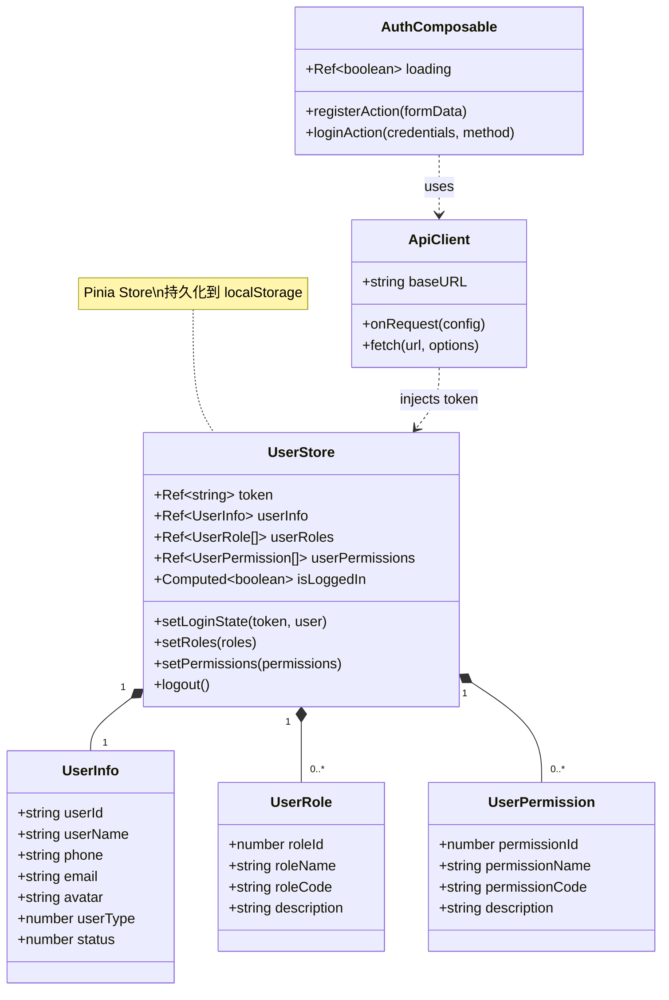

**说明**: 用户登录、注册、权限验证核心模块

---

### 2. 实时通信 - WebSocket

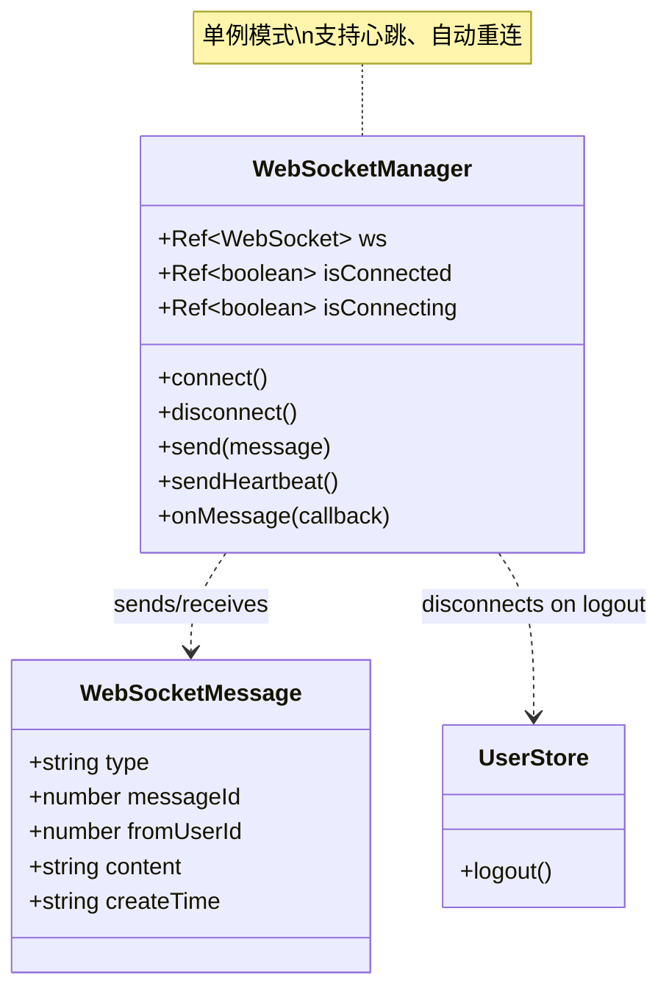

**说明**: WebSocket 连接管理，支持实时消息推送

---

### 3. 实时通信 - 私信聊天

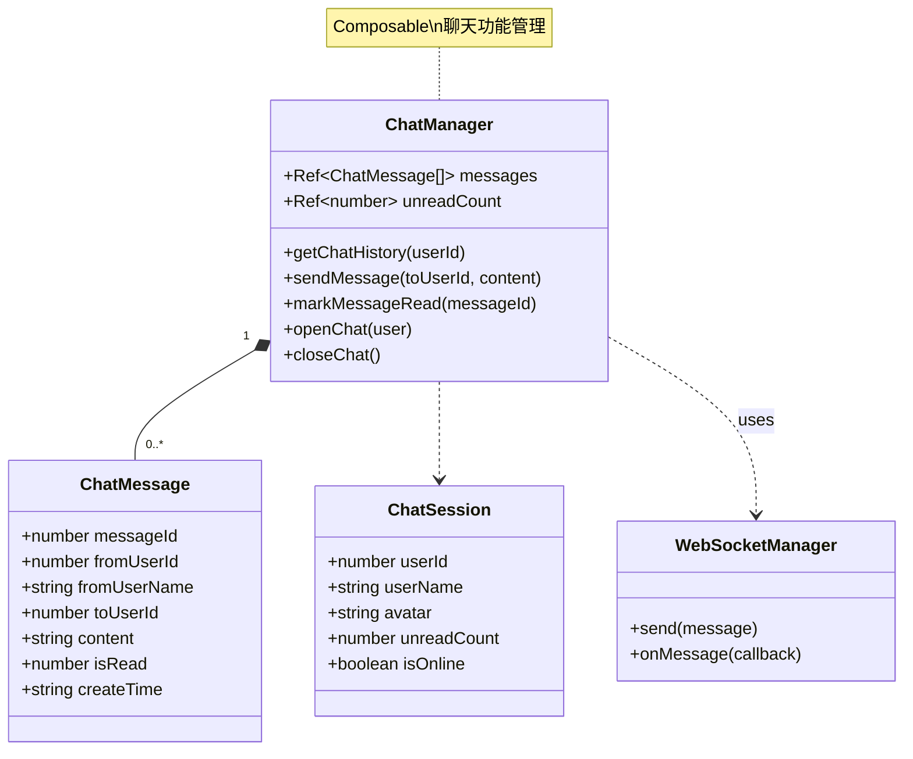

**说明**: 用户间私信聊天功能

---

### 4. 社区论坛

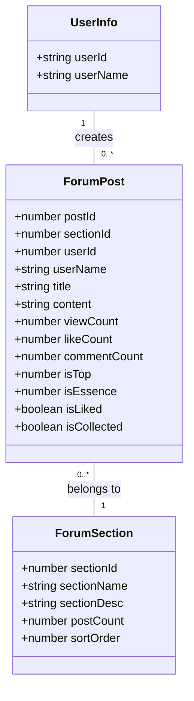

**说明**: 论坛板块和帖子管理

---

### 5. 好友与通知

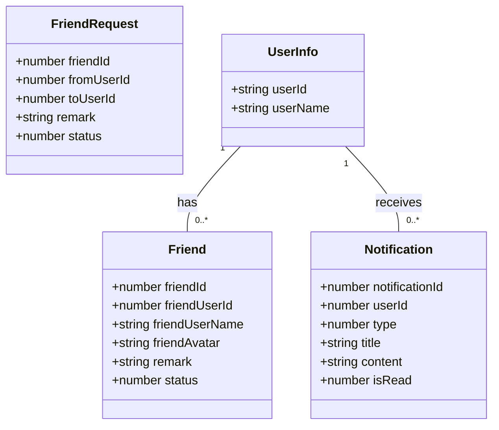

**说明**: 好友关系和系统通知

---

### 6. 物业服务管理

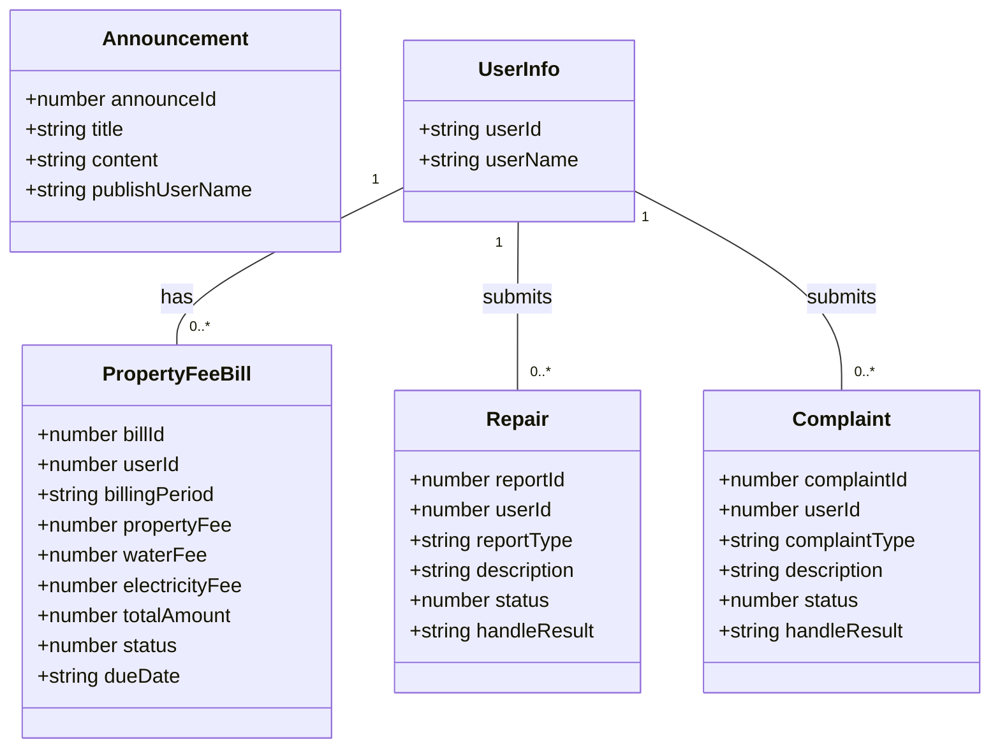

**说明**: 物业费、报修、投诉、公告管理

---

### 7. 安保管理

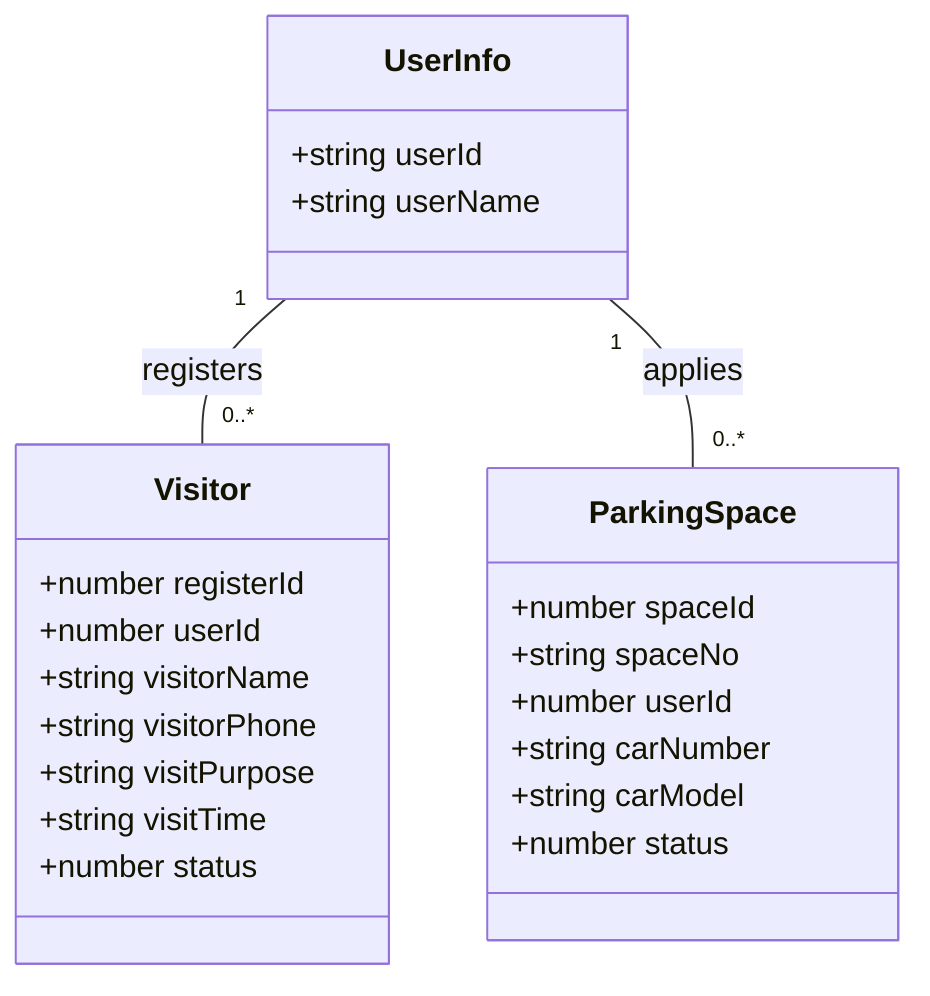

**说明**: 访客登记和车位管理

---

### 8. AI 智能助手

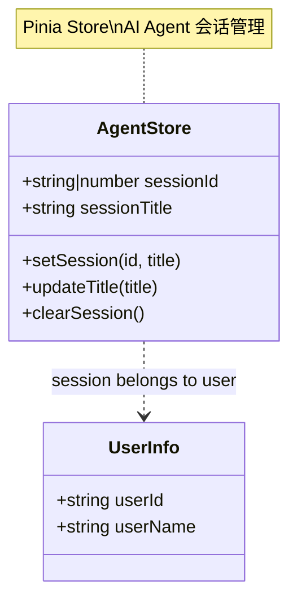

**说明**: AI 智能助手会话管理

---

## 商城功能模块

### 9. 商品与分类管理

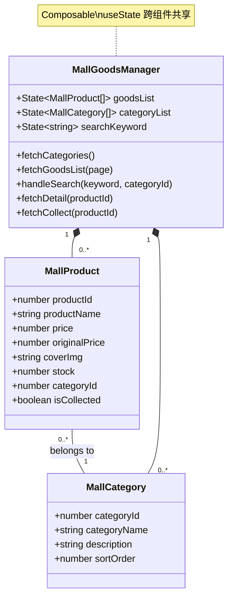

**说明**: 商品浏览、搜索、分类管理

---

### 10. 购物车管理

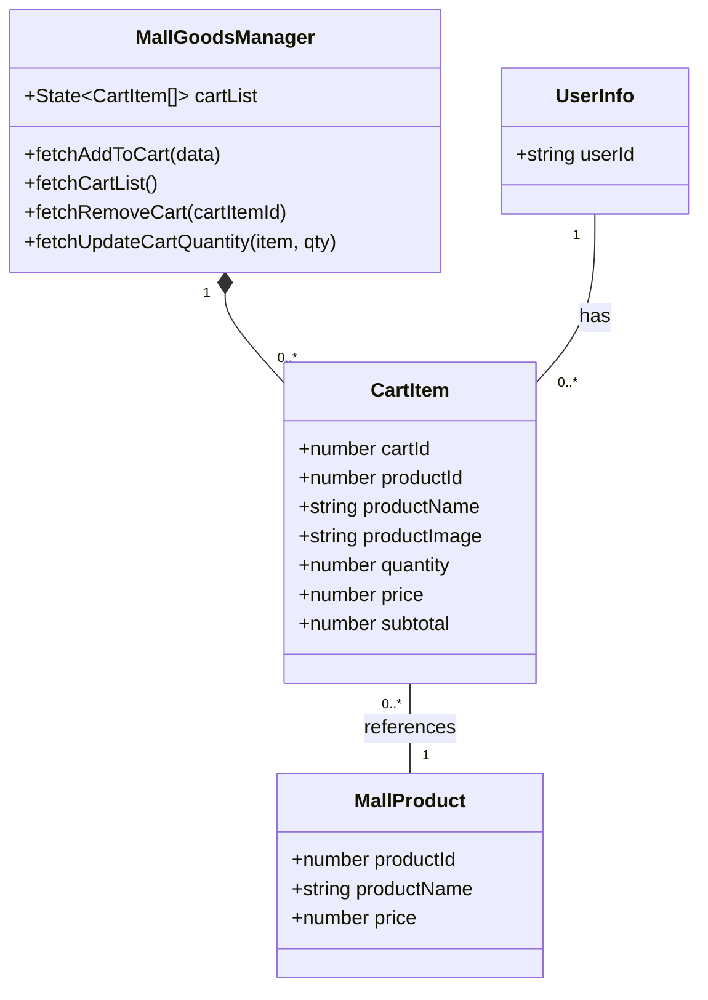

**说明**: 购物车增删改查

---

### 11. 订单管理

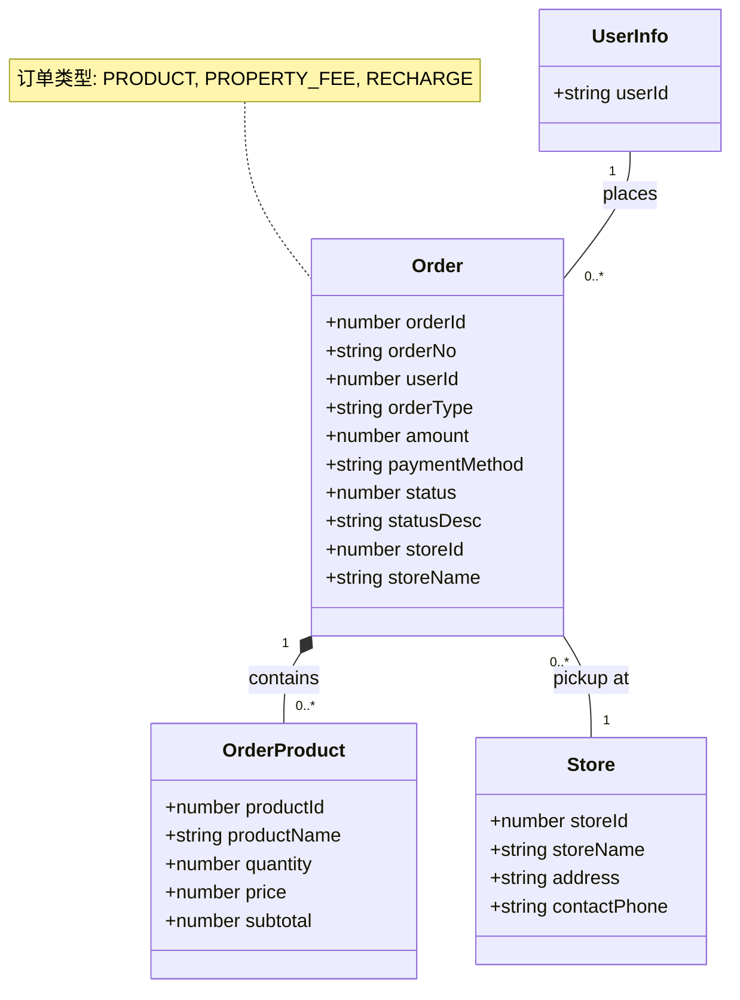

**说明**: 订单创建、查询、管理

---

### 12. 支付系统

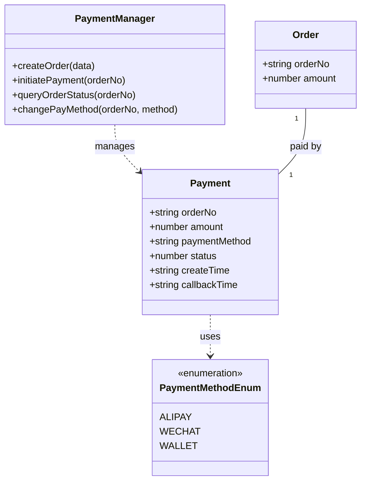

**说明**: 支付流程管理

---

### 13. 钱包系统

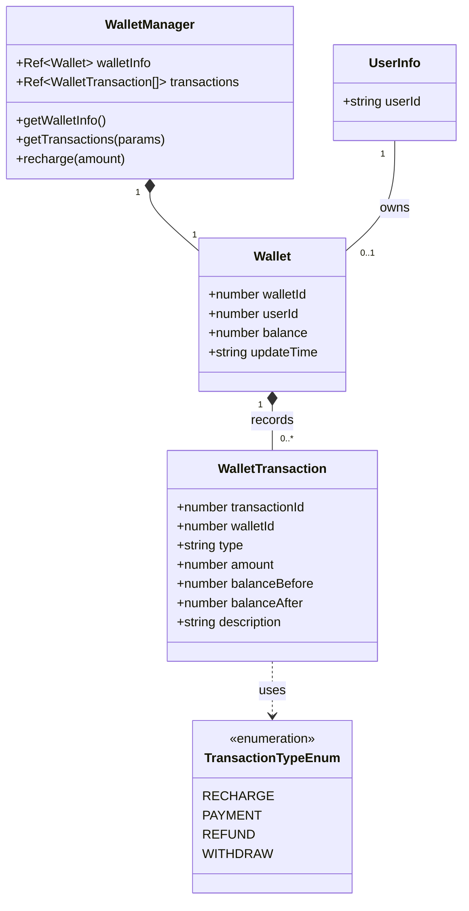

**说明**: 钱包余额和交易记录管理

---

## 📊 技术架构总览

### 状态管理层次
- **Pinia Stores**: UserStore, AgentStore（全局状态）
- **Composables**: ChatManager, MallGoodsManager, OrderManager, WalletManager（业务逻辑）
- **useState**: 跨组件共享状态（商城列表、购物车等）

### 通信机制
- **WebSocket**: 实时消息推送（聊天、通知）
- **HTTP API**: RESTful API（CRUD 操作）
- **JWT Token**: Bearer Token 认证

### 设计模式
- **单例模式**: WebSocketManager
- **观察者模式**: WebSocket 消息回调
- **组合模式**: Composable 函数组合
- **仓储模式**: Pinia Store

---

## 🔗 模块间关系

### 社区功能依赖关系
```
UserStore (核心)
    ↓
WebSocketManager → ChatManager
    ↓
Forum, Friend, Notification, Property, Security
```

### 商城功能依赖关系
```
UserStore (核心)
    ↓
MallGoodsManager → CartItem
    ↓
OrderManager → PaymentManager
    ↓
WalletManager
```

---

**生成时间**: 2026-01-14
**框架版本**: Nuxt 4.2.2, Vue 3.5.26
**项目类型**: 智慧社区管理平台（全栈应用）
