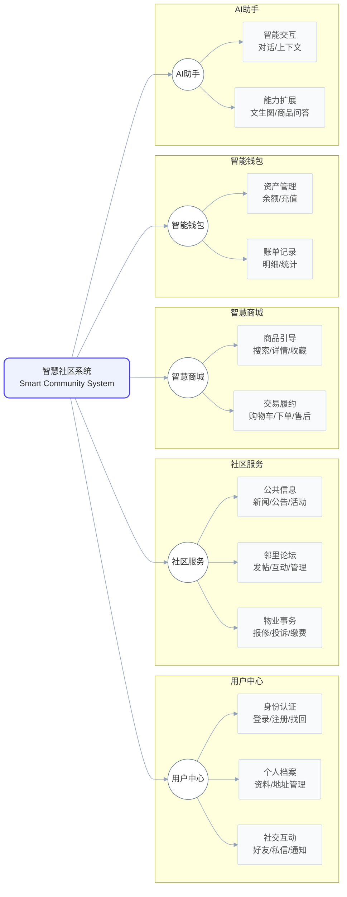

```mermaid
graph LR
    %% 核心节点样式
    classDef cloud fill:#eef2ff,stroke:#4f46e5,stroke-width:2px,rx:10,ry:10,color:#333;
    classDef module fill:#fff,stroke:#64748b,stroke-width:1px,rx:5,ry:5,color:#333;
    classDef feature fill:#f8fafc,stroke:#cbd5e1,stroke-width:1px,rx:2,ry:2,color:#555;

    Root[智慧社区系统<br>Smart Community System]:::cloud

    %% 1. 用户中心
    subgraph UserModule [用户中心]
        direction TB
        User((用户中心)):::module
        U_Auth[身份认证<br>登录/注册/找回]:::feature
        U_Profile[个人档案<br>资料/地址管理]:::feature
        U_Social[社交互动<br>好友/私信/通知]:::feature
        
        User --> U_Auth
        User --> U_Profile
        User --> U_Social
    end

    %% 2. 社区服务
    subgraph CommModule [社区服务]
        direction TB
        Comm((社区服务)):::module
        C_Info[公共信息<br>新闻/公告/活动]:::feature
        C_Forum[邻里论坛<br>发帖/互动/管理]:::feature
        C_Prop[物业事务<br>报修/投诉/缴费]:::feature
        
        Comm --> C_Info
        Comm --> C_Forum
        Comm --> C_Prop
    end

    %% 3. 智慧商城
    subgraph MallModule [智慧商城]
        direction TB
        Mall((智慧商城)):::module
        M_Browse[商品引导<br>搜索/详情/收藏]:::feature
        M_Order[交易履约<br>购物车/下单/售后]:::feature
        
        Mall --> M_Browse
        Mall --> M_Order
    end

    %% 4. 智能钱包
    subgraph WalletModule [智能钱包]
        direction TB
        Wallet((智能钱包)):::module
        W_Asset[资产管理<br>余额/充值]:::feature
        W_Bill[账单记录<br>明细/统计]:::feature
        
        Wallet --> W_Asset
        Wallet --> W_Bill
    end

    %% 5. AI助手
    subgraph AgentModule [AI助手]
        direction TB
        Agent((AI助手)):::module
        A_Chat[智能交互<br>对话/上下文]:::feature
        A_Tool[能力扩展<br>文生图/商品问答]:::feature

        Agent --> A_Chat
        Agent --> A_Tool
    end

    %% 连接根节点到各模块
    Root --> User
    Root --> Comm
    Root --> Mall
    Root --> Wallet
    Root --> Agent

    %% 样式调整
    linkStyle default stroke:#94a3b8,stroke-width:1px,fill:none;
```
